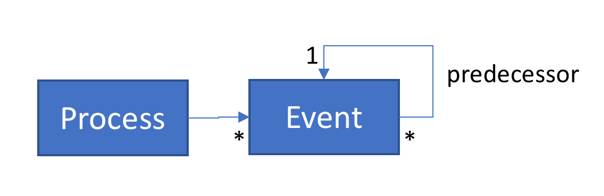
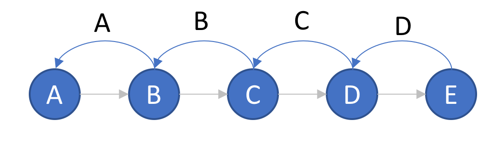
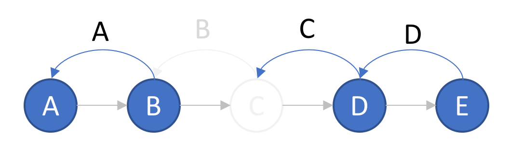

...
## Motivation
### Monitoring event processing

For a given process multiple events may be produced:

A sequence of process events may look like this:

A process progresses from state A to B to C to D to E. Every new process state knows about its predecessor. In this simplified version branching is not considered, neither are final states, except that the first event state has no predecessor. 

### Out of sequence event processing
Ingesting process events often times in not straight forward however. In a distributed world events may be produced in sequence, but the event emission and subsequent ingestion may be out of sequence.

This can be due to several reasons. One reason for this may be **slow event producers**. 
Keeping in mind that the actual focus of operational systems is to progress the process and not to report on it,
the actual process execution may have a higher priority and events are emitted with less priority. For example the actual work carried out could be done in milliseconds and the notification of the next applications may happen almost instantly, but emitting the process events may only happen in a scheduled batch every 5 minutes.

Another reason for out of sequence event ingestion may be that events use different routes to reach the processing engine or that they are ingested in parallel and that they are in a queue that is busier than the others. 

And sometimes events may **disappear** completely or are delayed for an extended amount of time, say hours or days.

Continuing from the picture from above, the sequence of events would be broken if event C would be delivered after events D and E.

The picture may then look like this instead:

### Benefits of analyzing incomplete event sequences

|ID | Predecessor ID|Time|
|---|---------------|----|
|A|-|t1|
|B|A|t2|
|D|C|t3|
|E|D|t4|

